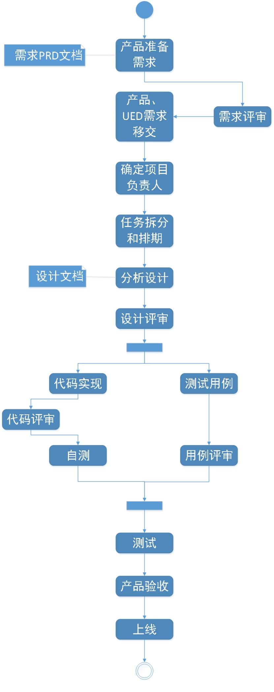

### 完整流程

### 开发流程
（1）需求分析设计：开发在开始写代码之前，一定要先做需求分析和设计。做完设计之后，整个代码该怎么写已经非常清楚。设计文档应该包括如下几个方面的内容：

        （1.1）数据库设计：ER图、SQL。

        （1.2）服务设计：画图整体描述一下设计。

        （1.3）服务接口：定义好接口名称，并简要描述此接口的功能，贴上swagger地址。

        （1.4）各个接口的详细设计：描述一下整个接口实现的主要逻辑，标识一下是否需要缓存等，最好画图辅助。

        （1.5）缓存整体设计（Redis）- 所有使用缓存的设计，请找经理统一评审。

        （1.6）ES整体设计（如果有）。

        （1.7）整理使用到的基础配置信息。
（2）设计评审：相关的后端、前端和测试（最好产品也参加一下）参与一起评审整个设计。

（3）自测：不管使用什么方式，比如unit test、接口swagger测试、debug方式测试，确保自己的所写代码的每一个分支都能cover到，都确实测试过。最终向提交到dev上面没有bug的目标迈进。对于前端自测，要基于测试用例来进行测试。

（4）上线：在整个开发过程中，将上线要特殊处理的东西登记一下。上线前夕，需求负责人去收集与梳理本次上线需要做的事情，然后组织相关人一起评审一下。