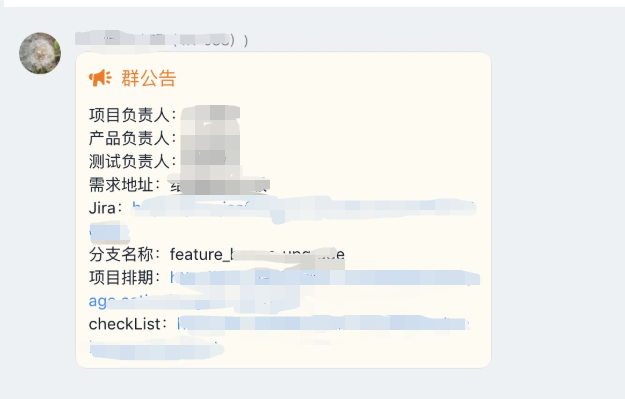

### 流程
1. 项目的产品负责人拉一个钉钉群(建议：钉钉项目群)，把相关人员拉入群中，在群的公告里面写上需求文档地址，交互稿地址等信息。

2. 一个项目要有一个总体负责人，负责整体项目的排期，进度，协调各个团队对接等。

3. 项目负责人确立这个项目代码分支名字并写在群公告，各端（前端，后端，移动端等）涉及到该项目代码都基于这个名字分支来开发。（分支是从master分支来拉取）

4. 项目负责人在群公告中加上上线checklist（confluence地址），里面加上这个项目上线的时候要做的一些额外准备工作 上线checklist 参考

5. 群公告写 项目负责人，产品负责人， 技术对接人 测试负责人

6. 项目负责人要负责整体各个合作团队团队任务边界划分：每个团队负责的开发边界， 每个测试负责的测试边界等

7. 项目负责人要群公告中写上排期文件链接 项目排期 - 示例

---

### 群公告中应该包含如下：
* 需求文档地址
* 交互稿地址
* 项目代码分支名字
* 项目负责人，产品负责人，测试负责人，20技术对接人
* 上线checklist列表
* 项目整体的排期链接 项目排期

---

### 示例
