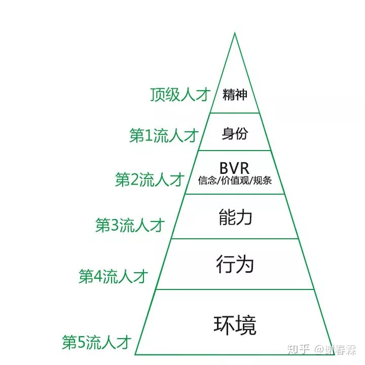

### NLP定义
「NLP理解层次」，即对一件事情的理解，我们可以分成6个不同的有高低之分的层次。

### NLP层次

### NLP人员划分
|理解梯度   |别名  |所处理解层次   |典型思考模式  |
|  ----  | ----  |  ----  | ----  |
| 顶级人才  | 领袖/伟人 | 精神/使命  | 人活着就是为了改变世界 |
| 第一流人才  | 觉醒者 | 身份  | 因为我是X，所以我会X |
| 第二流人才  | 战略家 | BVR（信念/价值观/规条）  | 什么才是最重要的 |
| 第三流人才  | 战术家 | 能力  | 方法总比问题多 |
| 第四流人才  | 行动派 | 行动  | 我还不够努力 |
| 第五流人才  | 怨妇 | 环境  | 都是你们的错 |

### BRV含义
* B（Believe）：信念，你相信什么是对的？
* V（Value）：价值观，你认为A和B哪个更重要？
* R（Rule）：规条，做人做事的原则。

【原文链接】  https://www.zhihu.com/question/301459876/answer/525937106 